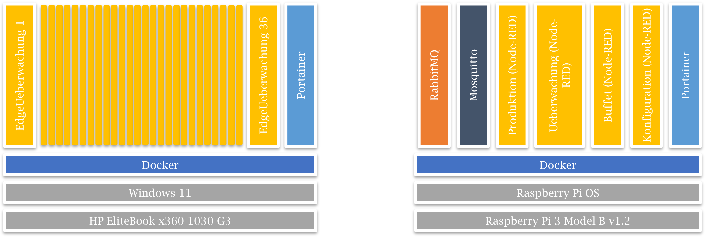

# MA-Digital-Industrial-Kitchen
In diesem Repository sind Ergebnisse der Masterthesis zum Thema „Eine Übersicht und exemplarische Anwendung von Szenario-basierter Digitalisierung mit IoT in Küchen von kleinen und mittelständischen Unternehmen“ aufgeführt. Die Zusammenhänge ergeben sich aus dem bereitgestellten Dokument MA_Digital_Industrial_Kitchen. Der primäre Zweck ist neben der Zugänglichkeit der Ergebnisse für die Öffentlichkeit, die Bereitstellung der ArchiMate Modelle sowie der Dateien und Anleitung für den erstellten Prototyp. Diese Anleitung ist inkl. Übersicht nachfolgend aufgeführt.

## Übersicht Prototyp Stack

## Übersicht Installationsschritte Prototyp
1. Basis Installation
2. Basis Setup in RabbitMQ
3. Basis Setup in Postgres
4. Basis Setup in Node-RED
5. Basis Setup Überwachung Edge
6. Einrichtung der Gesamtlösung
7. Ausführung der Gesamtlösung
8. Herunterfahren der Gesamtlösung

## 1. Basis Installation
Zwei Systeme mit Docker Runtime benötigt, welche miteinander kommunizieren können sollten. Ein ausgewähltes System eins benötigt die folgenden Container:

-	Portainer (auf Port 9443; 8000 | Image: [portainer/portainer-ce:latest](https://hub.docker.com/r/portainer/portainer-ce))
-	Mosquitto (auf Port 1883 | Image: [eclipse-mosquitto:latest](https://hub.docker.com/_/eclipse-mosquitto))
-	RabbitMQ (auf Port 5672; 15672 | Image: [rabbitmq:3-management-alpine](https://hub.docker.com/_/rabbitmq))
-	Postges (auf Port 5432 | Image: [postgres:latest](https://hub.docker.com/_/postgres))
-	Node-RED_1 (auf Port 1880 | Image: [nodered/node-red:latest](https://hub.docker.com/r/nodered/node-red))
-	Node-RED_2 (auf Port 1881)
-	Node-RED_3 (auf Port 1882)
-	Node-RED_4 (auf Port 1884)
-	Node-RED_5 (auf Port 1885)

Für ein zweites System wird empfohlen, ebenfalls Portainer zu installieren. Auf einem System der Wahl (Kommunikationskanal zu Systemen der Lösung benötigt) [Insomnia](https://insomnia.rest/) installieren.

## 2. Basis Setup in RabbitMQ
Erstellung der benötigten Exchanges zur Kommunikation in Browser User Interface, Type = direct, Durability = Durable, Name =
-	Buffet
-	Konfiguration
-	Produktion
-	Ueberwachung

## 3. Basis Setup in Postgres
Erstellung der benötigten Database „ueberwachungbuffet“ (gelingt über Container Konsole via Portainer).

## 4.	Basis Setup in Node-RED
Importieren der Flows in eigenen, separaten Container. Folgende Zuweisung wird empfohlen:
-	Externer Port 1880: Buffet
-	Externer Port 1881: Wächter
-	Externer Port 1882: Konfiguration
-	Externer Port 1884: Produktion
-	Externer Port 1885: Ueberwachung Core
In Portainer die Container ID von allen außer dem Wächter-Container für den späteren Verlauf notieren. In der Node-RED Umgebung nach Bedarf der Flows folgende Nodes zusätzlich installieren:
-	AMQP für RabbitMQ: @stormpass/node-red-contrib-amqp
-	Postgresql für Postgres: node-red-contrib-postgresql
Anschließend die Konfigurationen für MQTT & AMQP Broker sowie für Postgres auf die eigene Umgebung anpassen. Im Wächter-Container die 4 Nodes mit dem Titel „Restart node red via Portainer“ ausfündig machen (rechts unten) und die URL auf die eigene Umgebung anzupassen sowie die zuvor kopierten Container IDs an der entsprechenden Stelle der URL ersetzen.

## 5.	Basis Setup Überwachung Edge
Auf das zweite System wechseln und die bereitgestellte [ueberwachungedge.tar](https://drive.google.com/file/d/1PBWBVkqwGMdzFdLC1KWDKTbiOtljkmSe/view?usp=sharing) in Docker importieren (Google Drive Link aufgrund der Größe der Datei). Alternativ kann mit den zur Verfügung gestellten Dateien ein eigenes Image erstellt werden (siehe dazu Anleitung [hier](https://nodejs.org/en/docs/guides/nodejs-docker-webapp)). Anschließend folgende Befehle in die Kommandozeile einfügen und ausführen (Imageverweis ist zu aktualisieren, Port nach außen kann angepasst werden):

`docker run --name eu111 -p 3111:3111 -e "NUM1=1" -e "NUM2=1" -e "NUM3=1" --restart unless-stopped -d philipp/edgeueberwachung`\
`docker run --name eu112 -p 3112:3112 -e "NUM1=1" -e "NUM2=1" -e "NUM3=2" --restart unless-stopped -d philipp/edgeueberwachung`\
`docker run --name eu113 -p 3113:3113 -e "NUM1=1" -e "NUM2=1" -e "NUM3=3" --restart unless-stopped -d philipp/edgeueberwachung`\
`docker run --name eu114 -p 3114:3114 -e "NUM1=1" -e "NUM2=1" -e "NUM3=4" --restart unless-stopped -d philipp/edgeueberwachung`\
`docker run --name eu115 -p 3115:3115 -e "NUM1=1" -e "NUM2=1" -e "NUM3=5" --restart unless-stopped -d philipp/edgeueberwachung`\
`docker run --name eu116 -p 3116:3116 -e "NUM1=1" -e "NUM2=1" -e "NUM3=6" --restart unless-stopped -d philipp/edgeueberwachung`\
`docker run --name eu117 -p 3117:3117 -e "NUM1=1" -e "NUM2=1" -e "NUM3=7" --restart unless-stopped -d philipp/edgeueberwachung`\
`docker run --name eu118 -p 3118:3118 -e "NUM1=1" -e "NUM2=1" -e "NUM3=8" --restart unless-stopped -d philipp/edgeueberwachung`\
`docker run --name eu119 -p 3119:3119 -e "NUM1=1" -e "NUM2=1" -e "NUM3=9" --restart unless-stopped -d philipp/edgeueberwachung`\
`docker run --name eu121 -p 3121:3121 -e "NUM1=1" -e "NUM2=2" -e "NUM3=1" --restart unless-stopped -d philipp/edgeueberwachung`\
`docker run --name eu122 -p 3122:3122 -e "NUM1=1" -e "NUM2=2" -e "NUM3=2" --restart unless-stopped -d philipp/edgeueberwachung`\
`docker run --name eu123 -p 3123:3123 -e "NUM1=1" -e "NUM2=2" -e "NUM3=3" --restart unless-stopped -d philipp/edgeueberwachung`\
`docker run --name eu124 -p 3124:3124 -e "NUM1=1" -e "NUM2=2" -e "NUM3=4" --restart unless-stopped -d philipp/edgeueberwachung`\
`docker run --name eu125 -p 3125:3125 -e "NUM1=1" -e "NUM2=2" -e "NUM3=5" --restart unless-stopped -d philipp/edgeueberwachung`\
`docker run --name eu126 -p 3126:3126 -e "NUM1=1" -e "NUM2=2" -e "NUM3=6" --restart unless-stopped -d philipp/edgeueberwachung`\
`docker run --name eu127 -p 3127:3127 -e "NUM1=1" -e "NUM2=2" -e "NUM3=7" --restart unless-stopped -d philipp/edgeueberwachung`\
`docker run --name eu128 -p 3128:3128 -e "NUM1=1" -e "NUM2=2" -e "NUM3=8" --restart unless-stopped -d philipp/edgeueberwachung`\
`docker run --name eu129 -p 3129:3129 -e "NUM1=1" -e "NUM2=2" -e "NUM3=9" --restart unless-stopped -d philipp/edgeueberwachung`\
`docker run --name eu131 -p 3131:3131 -e "NUM1=1" -e "NUM2=3" -e "NUM3=1" --restart unless-stopped -d philipp/edgeueberwachung`\
`docker run --name eu132 -p 3132:3132 -e "NUM1=1" -e "NUM2=3" -e "NUM3=2" --restart unless-stopped -d philipp/edgeueberwachung`\
`docker run --name eu133 -p 3133:3133 -e "NUM1=1" -e "NUM2=3" -e "NUM3=3" --restart unless-stopped -d philipp/edgeueberwachung`\
`docker run --name eu134 -p 3134:3134 -e "NUM1=1" -e "NUM2=3" -e "NUM3=4" --restart unless-stopped -d philipp/edgeueberwachung`\
`docker run --name eu135 -p 3135:3135 -e "NUM1=1" -e "NUM2=3" -e "NUM3=5" --restart unless-stopped -d philipp/edgeueberwachung`\
`docker run --name eu136 -p 3136:3136 -e "NUM1=1" -e "NUM2=3" -e "NUM3=6" --restart unless-stopped -d philipp/edgeueberwachung`\
`docker run --name eu137 -p 3137:3137 -e "NUM1=1" -e "NUM2=3" -e "NUM3=7" --restart unless-stopped -d philipp/edgeueberwachung`\
`docker run --name eu138 -p 3138:3138 -e "NUM1=1" -e "NUM2=3" -e "NUM3=8" --restart unless-stopped -d philipp/edgeueberwachung`\
`docker run --name eu139 -p 3139:3139 -e "NUM1=1" -e "NUM2=3" -e "NUM3=9" --restart unless-stopped -d philipp/edgeueberwachung`\
`docker run --name eu141 -p 3141:3141 -e "NUM1=1" -e "NUM2=4" -e "NUM3=1" --restart unless-stopped -d philipp/edgeueberwachung`\
`docker run --name eu142 -p 3142:3142 -e "NUM1=1" -e "NUM2=4" -e "NUM3=2" --restart unless-stopped -d philipp/edgeueberwachung`\
`docker run --name eu143 -p 3143:3143 -e "NUM1=1" -e "NUM2=4" -e "NUM3=3" --restart unless-stopped -d philipp/edgeueberwachung`\
`docker run --name eu144 -p 3144:3144 -e "NUM1=1" -e "NUM2=4" -e "NUM3=4" --restart unless-stopped -d philipp/edgeueberwachung`\
`docker run --name eu145 -p 3145:3145 -e "NUM1=1" -e "NUM2=4" -e "NUM3=5" --restart unless-stopped -d philipp/edgeueberwachung`\
`docker run --name eu146 -p 3146:3146 -e "NUM1=1" -e "NUM2=4" -e "NUM3=6" --restart unless-stopped -d philipp/edgeueberwachung`\
`docker run --name eu147 -p 3147:3147 -e "NUM1=1" -e "NUM2=4" -e "NUM3=7" --restart unless-stopped -d philipp/edgeueberwachung`\
`docker run --name eu148 -p 3148:3148 -e "NUM1=1" -e "NUM2=4" -e "NUM3=8" --restart unless-stopped -d philipp/edgeueberwachung`\
`docker run --name eu149 -p 3149:3149 -e "NUM1=1" -e "NUM2=4" -e "NUM3=9" --restart unless-stopped -d philipp/edgeueberwachung`

Um die Instanzen einem Buffet und einer Chafing-Dish zuzuweisen in der Kommandozeile folgende Befehl-Reihe ausführen (Anpassung der URL auf IP des zweiten Systems nötig):

`curl -X POST "http://192.168.178.44:3111/buffet?buffetId=1&buffetName=PrimaryOutside&chafingDishId=1"`\
`curl -X POST "http://192.168.178.44:3112/buffet?buffetId=1&buffetName=PrimaryOutside&chafingDishId=2"`\
`curl -X POST "http://192.168.178.44:3113/buffet?buffetId=1&buffetName=PrimaryOutside&chafingDishId=3"`\
`curl -X POST "http://192.168.178.44:3114/buffet?buffetId=1&buffetName=PrimaryOutside&chafingDishId=4"`\
`curl -X POST "http://192.168.178.44:3115/buffet?buffetId=1&buffetName=PrimaryOutside&chafingDishId=5"`\
`curl -X POST "http://192.168.178.44:3116/buffet?buffetId=1&buffetName=PrimaryOutside&chafingDishId=6"`\
`curl -X POST "http://192.168.178.44:3117/buffet?buffetId=1&buffetName=PrimaryOutside&chafingDishId=7"`\
`curl -X POST "http://192.168.178.44:3118/buffet?buffetId=1&buffetName=PrimaryOutside&chafingDishId=8"`\
`curl -X POST "http://192.168.178.44:3119/buffet?buffetId=1&buffetName=PrimaryOutside&chafingDishId=9"`\
`curl -X POST "http://192.168.178.44:3121/buffet?buffetId=2&buffetName=SecundaryOutside&chafingDishId=1"`\
`curl -X POST "http://192.168.178.44:3122/buffet?buffetId=2&buffetName=SecundaryOutside&chafingDishId=2"`\
`curl -X POST "http://192.168.178.44:3123/buffet?buffetId=2&buffetName=SecundaryOutside&chafingDishId=3"`\
`curl -X POST "http://192.168.178.44:3124/buffet?buffetId=2&buffetName=SecundaryOutside&chafingDishId=4"`\
`curl -X POST "http://192.168.178.44:3125/buffet?buffetId=2&buffetName=SecundaryOutside&chafingDishId=5"`\
`curl -X POST "http://192.168.178.44:3126/buffet?buffetId=2&buffetName=SecundaryOutside&chafingDishId=6"`\
`curl -X POST "http://192.168.178.44:3127/buffet?buffetId=2&buffetName=SecundaryOutside&chafingDishId=7"`\
`curl -X POST "http://192.168.178.44:3128/buffet?buffetId=2&buffetName=SecundaryOutside&chafingDishId=8"`\
`curl -X POST "http://192.168.178.44:3129/buffet?buffetId=2&buffetName=SecundaryOutside&chafingDishId=9"`\
`curl -X POST "http://192.168.178.44:3131/buffet?buffetId=3&buffetName=TertiaryOutside&chafingDishId=1"`\
`curl -X POST "http://192.168.178.44:3132/buffet?buffetId=3&buffetName=TertiaryOutside&chafingDishId=2"`\
`curl -X POST "http://192.168.178.44:3133/buffet?buffetId=3&buffetName=TertiaryOutside&chafingDishId=3"`\
`curl -X POST "http://192.168.178.44:3134/buffet?buffetId=3&buffetName=TertiaryOutside&chafingDishId=4"`\
`curl -X POST "http://192.168.178.44:3135/buffet?buffetId=3&buffetName=TertiaryOutside&chafingDishId=5"`\
`curl -X POST "http://192.168.178.44:3136/buffet?buffetId=3&buffetName=TertiaryOutside&chafingDishId=6"`\
`curl -X POST "http://192.168.178.44:3137/buffet?buffetId=3&buffetName=TertiaryOutside&chafingDishId=7"`\
`curl -X POST "http://192.168.178.44:3138/buffet?buffetId=3&buffetName=TertiaryOutside&chafingDishId=8"`\
`curl -X POST "http://192.168.178.44:3139/buffet?buffetId=3&buffetName=TertiaryOutside&chafingDishId=9"`\
`curl -X POST "http://192.168.178.44:3141/buffet?buffetId=4&buffetName=PrimaryInside&chafingDishId=1"`\
`curl -X POST "http://192.168.178.44:3142/buffet?buffetId=4&buffetName=PrimaryInside&chafingDishId=2"`\
`curl -X POST "http://192.168.178.44:3143/buffet?buffetId=4&buffetName=PrimaryInside&chafingDishId=3"`\
`curl -X POST "http://192.168.178.44:3144/buffet?buffetId=4&buffetName=PrimaryInside&chafingDishId=4"`\
`curl -X POST "http://192.168.178.44:3145/buffet?buffetId=4&buffetName=PrimaryInside&chafingDishId=5"`\
`curl -X POST "http://192.168.178.44:3146/buffet?buffetId=4&buffetName=PrimaryInside&chafingDishId=6"`\
`curl -X POST "http://192.168.178.44:3147/buffet?buffetId=4&buffetName=PrimaryInside&chafingDishId=7"`\
`curl -X POST "http://192.168.178.44:3148/buffet?buffetId=4&buffetName=PrimaryInside&chafingDishId=8"`\
`curl -X POST "http://192.168.178.44:3149/buffet?buffetId=4&buffetName=PrimaryInside&chafingDishId=9"`

Für die erfolgreiche Ausführung wird neben dem lauffähigen Container ein Kommunikationkanal mit System 1 und dessen Postgres-Instanz benötigt. Anschließend kann zur einfachen Verwaltung der zuvor gestarteten Container das Portainer-Webinterface genutzt werden. Die Container sollten zur Schonung von Ressourcen an dieser Stelle gestoppt werden.

## 6.	Einrichtung der Gesamtlösung
Auf System mit Insomnia sind die bereitgestellten Anfragen „Insomnia_Prototyp_Requests.json“ zu importieren. Es ist die vorhandene IP-Adresse mit der des ersten Systems zu ersetzen (mit Ausnahme von UebwachungEdge, hier die IP des zweiten Systems einsetzen). Anschließend folgende Anfragen ausführen:
1.	Buffet/Buffet Template/Erstelle Template 1
2.	Buffet/Buffet Template/Erstelle Template 2
3.	Konfiguration/Erstelle Hochzeit Peters
4.	Konfiguration/Erstelle Hochzeit Maiers

Die Konfigurationen sind automatisch deaktiviert nach der Erstellung.

## 7. Ausführung der Gesamtlösung
Die zuvor gestoppten Container auf System 2 können nun erneut gestartet werden. Sobald diese im Betrieb sind, können die Konfigurationen aktiviert werden:
1.	Konfiguration/Peters Konfig aktivieren
2.	Konfiguration/Maiers Konfig aktivieren

Nach einer Minute sollten die ersten UeberwachungEdge Container ihre simulierten Daten kommunizieren. Mit den zur Verfügung gestellten GET-Anfragen können aktuelle Daten abgerufen werden. In Ueberwachung Core kann die BuffetID und Chafing-DishID nach Interesse variiert werden.

## 8.	Herunterfahren der Gesamtlösung
Um die Lösung ordnungsgemäß herunterzufahren, wird empfohlen, die Konfigurationen zu deaktivieren:
1.	Konfiguration/Peters Konfig deaktivieren
2.	Konfiguration/Maiers Konfig deaktivieren

Die Systeme können nun heruntergefahren werden. Falls dieser Schritt ausgelassen wird, würde das Starten der UeberwachungEdge Container dafür sorgen, dass nach jedem neu gestarteten Container die Konfiguration erneut an alle versendet wird. Die korrekte Funktion der Lösung wird dadurch nicht beeinträchtigt. 

